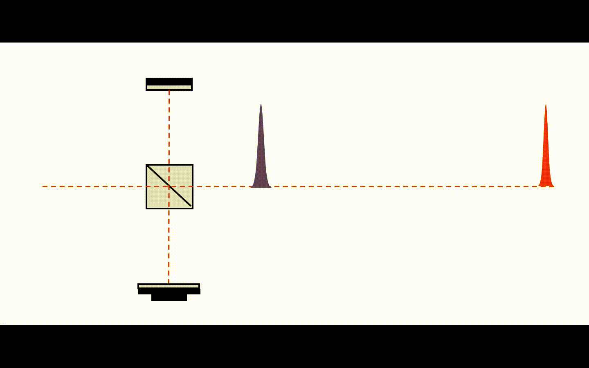
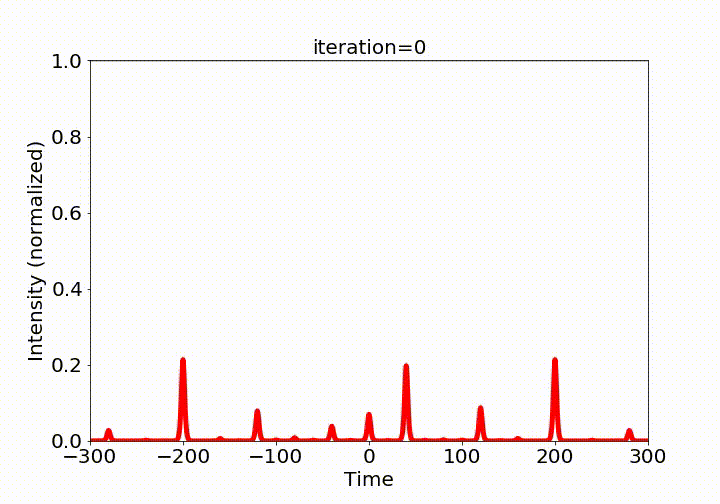

# An Optical Control Environment for Benchmarking Reinforcement Learning Algorithms

This repository introduces the Optical Control Environment (OPS) designed for benchmarking reinforcement learning algorithms, as illustrated in the following papers:
 
Abulikemu Abuduweili, Jie Wang, Bowei Yang, Aimin Wang, and Zhigang Zhang, "[Reinforcement learning based robust control algorithms for coherent pulse stacking](https://opg.optica.org/oe/fulltext.cfm?uri=oe-29-16-26068&id=453824)," Opt. Express, 2021.   

Abulikemu Abuduweili, and Changliu Liu, "[An Optical Control Environment for Benchmarking Reinforcement Learning Algorithms](https://openreview.net/forum?id=61TKzU9B96)," TMLR, 2023.


## Introduction
Deep reinforcement learning has the potential to address various scientific problems. In this paper, we implement an optics simulation environment for reinforcement learning based controllers. The environment captures the essence of nonconvexity, nonlinearity, and time-dependent noise inherent in optical systems, offering a more realistic setting. 
Subsequently, we provide the benchmark results of several reinforcement learning algorithms on the proposed simulation environment. The experimental findings demonstrate the superiority of off-policy reinforcement learning approaches over traditional control algorithms in navigating the intricacies of complex optical control environments. 


## Simulation Environment
In this paper, we present OPS (Optical Pulse Stacking), an open and scalable simulator designed for controlling typical optical systems. 
A visual illustration of the stacking procedure for combining two pulses is shown in the following gif.   


## Results
TD3 and SAC are capable of attaining maximum power in the OPS task by combining many pulses into one, as shown in the following gif.    



## About Code

Install Requirments
```bash
pip install numpy yaml scipy pynlo gym 

```
Training the TD3 algorithm on a 5-stage hard-mode OPS environment:
```bash
python main.py --stage 5 --difficulty hard --algo td3

```


The simulation OPS environment is located in [environments/stacking_env.py](environments/stacking_env.py). 

The RL algorithms are based on [stable-baselines3](https://github.com/DLR-RM/stable-baselines3). 


## Citation
If you find the code helpful in your research or work, please cite the following papers.
```BibTex
@inproceedings{abuduweili2023an,
  title={An Optical Control Environment for  Benchmarking Reinforcement Learning Algorithms},
  author={Abuduweili, Abulikemu and Liu, Changliu},
  booktitle={Transactions on Machine Learning Research},
  year={2023},
}

@article{Abuduweili:21,
  author = {Abulikemu Abuduweili and Jie Wang and Bowei Yang and Aimin Wang and Zhigang Zhang},
  journal = {Opt. Express},
  pages = {26068--26081},
  title = {Reinforcement learning based robust control algorithms for coherent pulse stacking},
  volume = {29},
  year = {2021},
}
```


