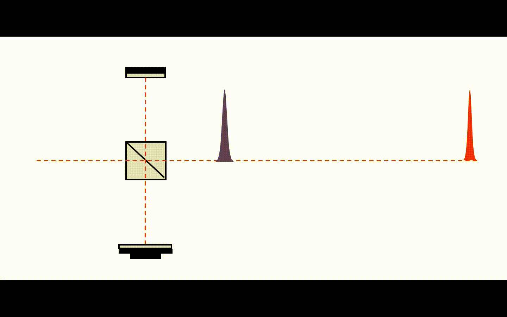
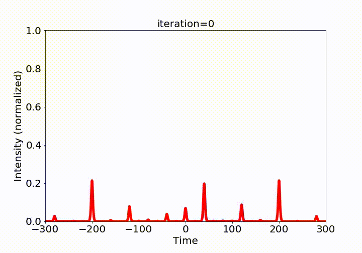

## Demo

Supplemental video 1   
 

[https://user-images.githubusercontent.com/6877923/115474571-03c75800-a23e-11eb-8096-8973aad5fa9f.mp4](https://github.com/Walleclipse/Reinforcement-Learning-Pulse-Stacking/blob/main/demo/Video1_SystemConfiguration_StackingTwoPulsesWithTimeDelay.mp4)

Supplemental video 2    
  

https://github.com/Walleclipse/Reinforcement-Learning-Pulse-Stacking/blob/main/demo/Video1_SystemConfiguration_StackingTwoPulsesWithTimeDelay.mp4 
