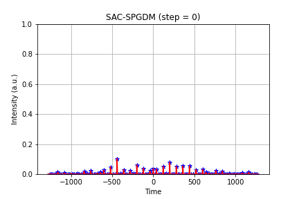
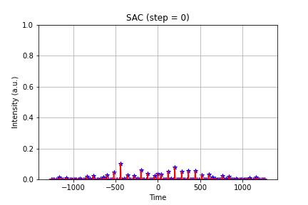
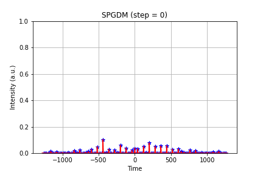
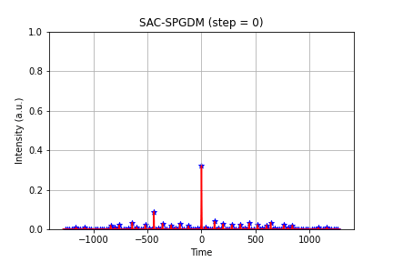
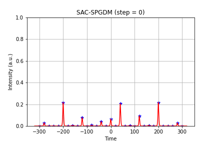
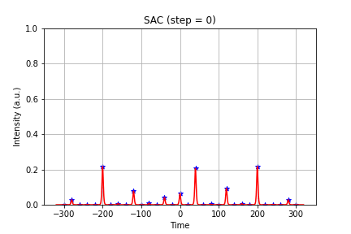
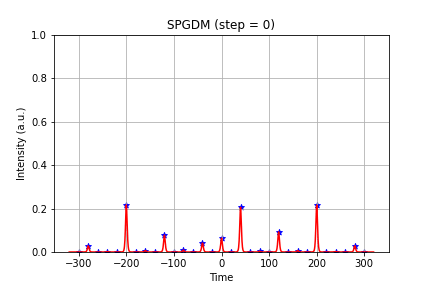
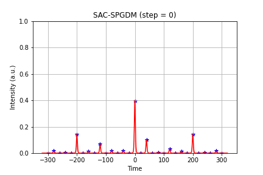

# SAC-SPGDM

## Contents
1. [Combining 128 pulses](#experiments on controlling 7-stage delay line coherent pulse stacking)
2. [Combining 32 pulses](#Experiments on controlling 5-stage delay line coherent pulse stacking (combining 32 pulse))

## Experiments on combining 128 pulses

### Results on controlling 7-stage coherent pulse stacking from the bad initial point 

In this scenario SPGDM (and SPGD) cannot find the maximum peak power, and controlled state is trapped into a saddle points (or bad local maximum). SAC-SPGDM and SAC could find the maximum and successfully control the system to obtain good combined pulses. The final power after 30 steps control for SAC-SPGDM and SAC is similar, but the control-convergence speed of SAC-SPGDM is slightly faster than SAC. 

### Results on controlling 7-stage coherent pulse stacking from the good initial point 

In this scenario, SAC-SPGDM, SAC as well as SPGDM successfully control the system to obtain good combined pulses. This is consistent with the previous conclusion that, SPGD based controller is a good choice when the starting point is near a maximum. SAC-SPGDM still has the fastest convergence speed among them. It is worth noting that, as a training-free method, SPGDM achieved the maximum point with faster speed than SPGD.  

## Experiments on combining 32 pulses

### Results on controlling 5-stage coherent pulse stacking from the bad initial point 

SAC-SPGDM and SAC successfully control the system to obtain good combined pulses. The control-convergence speed of SAC-SPGDM is slightly faster than SAC. 

### Results on controlling 5-stage coherent pulse stacking from the good initial point 

SAC-SPGDM still has the fastest convergence speed among them. It is worth noting that, as a training-free method, SPGDM achieved the maximum point faster than SPGD.  

---
**More experimental demonstrations  will be updated soon.**
