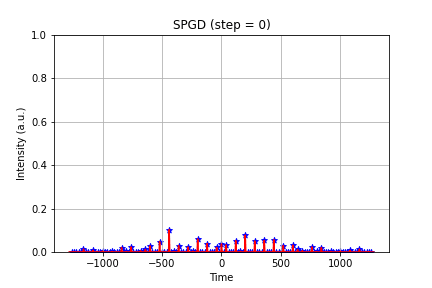
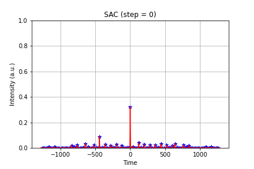
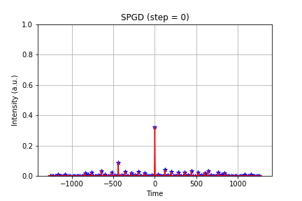
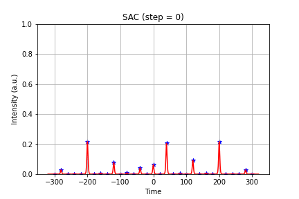
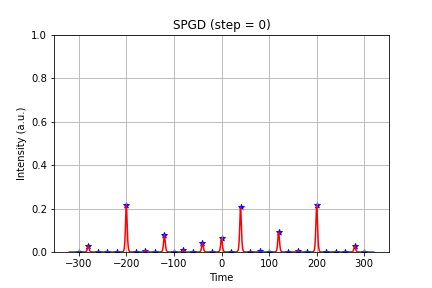
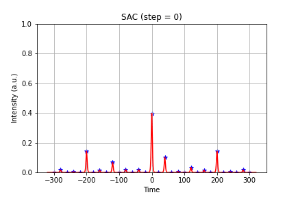
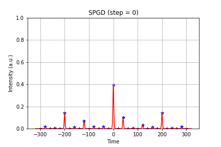

# SAC-SPGDM

## Contents
1. [Combining 128 pulses](#experiments-on-combining-128-pulses)    
    1. [Controlling 7-stage CPS from random initial state](#controlling-7-stage-coherent-pulse-stacking-from-the-random-initial-point) 
    2. [Controlling 7-stage CPS from nearly matched initial state](#controlling-7-stage-coherent-pulse-stacking-from-the-nearly-matched-initial-point) 
2. [Combining 32 pulses](#experiments-on-combining-32-pulses)  
    1. [Controlling 5-stage CPS from random initial state](#controlling-5-stage-coherent-pulse-stacking-from-the-random-initial-point) 
    2. [Controlling 5-stage CPS from nearly matched initial state](#controlling-5-stage-coherent-pulse-stacking-from-the-nearly-matched-initial-point) 

## Experiments on combining 128 pulses

### Controlling 7-stage coherent pulse stacking from the random initial point 

In this scenario SPGD cannot find the maximum peak power, and controlled state is trapped into a saddle points (or bad local maximum). RL methods, such as  SAC, could find the maximum and successfully control the system to obtain good combined pulses. 

### Controlling 7-stage coherent pulse stacking from the nearly matched initial point 

In this scenario, SAC and SPGD successfully control the system to obtain good combined pulses. This is consistent with the previous conclusion that, SPGD based controller is a good choice when the starting point is near a maximum.   

## Experiments on combining 32 pulses

### Controlling 5-stage coherent pulse stacking from the random initial point 

SAC successfully control the system to obtain good combined pulses.  

### Controlling 5-stage coherent pulse stacking from the nearly matched initial point 

SAC still has the fastest convergence speed among them. 

---
